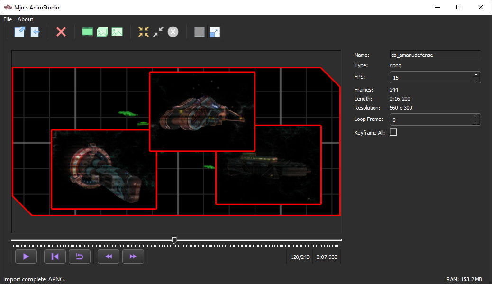

<br />
<div align="center">
  <a href="https://github.com/MjnMixael/AnimStudio">
    
  </a>

  <h3 align="center">Anim Studio</h3>

  <p align="center">
    A powerful animation creation and conversion tool for FreeSpace Open formats.
  </p>
</div>

## About

AnimStudio is a Qt-based application designed to import, preview, edit, quantize, and export animations compatible with the FreeSpace Open engine. It supports raw image sequences and FreeSpace-native animation formats like .ani, .eff, and .apng (exported as .png due to FSO filename limitations).

AnimStudio can be used interactively via its GUI or in batch mode from the command line for high-speed animation conversion workflows.

AnimStudio uses [QT Designer](https://www.qt.io/product/ui-design-tools) for it's UI development.

## Features

- Load image sequences or animation files (.ani, .eff, .png/.apng)
- Preview and scrub through frames with frame-by-frame control
- Apply color quantization with palette customization
- Import and manage built-in or user-supplied palettes
- Export to .ani, .eff, .png (APNG) or raw image sequences
- Supports transparency, keyframes, and format-specific metadata
- Cross-platform (Windows/Linux) and fast, native performance
- Command-line batch conversion support

## Usage (GUI)



1. Load Animation
Open a .ani, .eff, .apng/.png, or folder of images to begin. Supported image formats include PNG, BMP, JPG, PCX, TGA. More types may be supported in the future.

2. Preview and Navigate
Use the timeline and frame viewer to step through the animation.

3. Adjust Metadata
Adjust the animation name, FPS, loop point, and keyframe settings.

3. Quantize (Optional)
Reduce color depth with a selected palette, or automatically generate one. Includes built-in palettes for common needs in FreespaceOpen such as Shield, HUD, or Loadout Icons.

4. Export
Use the Export dialog to choose format, image type, and destination.

## Usage (Command Line)

AnimStudio can run headless to batch convert animations. Example:
```bash
AnimStudio.exe -i path/to/input -o path/to/output -t ani -q -p auto -v 90 -c 256
```
The above command:
- Loads an animation from the given input path  
- Exports it as a `.ani` file to the specified output  
- Enables quantization with an automatically generated palette  
- Sets quantization quality to 90 and color count to 256  

### Available Options

| Short | Long              | Description                                                                 |
|-------|-------------------|-----------------------------------------------------------------------------|
| `-i`  | `--in`            | **Required.** Input animation file or directory                             |
| `-o`  | `--out`           | **Required.** Output file or folder path                                    |
| `-t`  | `--type`          | **Required.** Export type: `ani`, `eff`, `apng`, or `raw`                   |
| `-e`  | `--ext`           | For `raw` export: Image extension (e.g., `png`, `jpg`, `bmp`, `pcx`, `tga`)               |
| `-n`  | `--basename`      | Optional. Override for the base name of exported files                      |
| `-q`  | `--quantize`      | Optional. Enables color quantization (required for `.ani`)                  |
| `-p`  | `--palette`       | Optional. Palette selection:<br>– `"auto"`: Auto-generated from source<br>– Built-in name (quoted if it contains spaces)<br>– `file:<path>`: Load a custom palette from a file |
| `-v`  | `--quality`       | Optional. Quantization quality (1–100) — higher = better                    |
| `-c`  | `--maxcolors`     | Optional. Max colors (1–256), only used with `"auto"` palette               |
| `-a`  | `--no-transparency` | Optional. Disables transparency in quantization                          |
|       | `--list-palettes` | Prints the names of built-in palettes and exits                             |


## Notes on Format Support

- ANI: Exports as indexed-color .ani with RLE compression. Requires quantization.
- EFF: Image sequence export with .eff metadata file. Supports PNG, JPG, BMP, PCX, TGA.
- APNG: Technically saved as .png due to FSO's 3-letter extension limit, but contains animation data.
- RAW: Saves all frames to image files in selected format, no metadata.

## Known Issues

- None currently!

## Dependencies

AnimStudio is built on a set of powerful open-source libraries to support various image formats, compression methods, and animation standards:

- **[libpng](http://www.libpng.org/pub/png/libpng.html)** – For PNG and APNG image handling  
- **[zlib](https://zlib.net/)** – Compression library used by libpng  
- **[libimagequant](https://pngquant.org/lib/)** (v2.x) – High-quality color quantization  
- **[apngdisassembler](https://github.com/apng-dasm/apng-disassembler)** – Used to extract frames from APNG files  
- **[apngasm](https://github.com/apngasm/apngasm)** – Used to assemble APNG files from individual frames
- **[compressonator](https://github.com/GPUOpen-Tools/compressonator)** - Used to allow reading and writing of DDS files

# Credits

AnimStudio is developed by MjnMixael.
Based on years of experience working with FreeSpace Open assets and animation formats.
